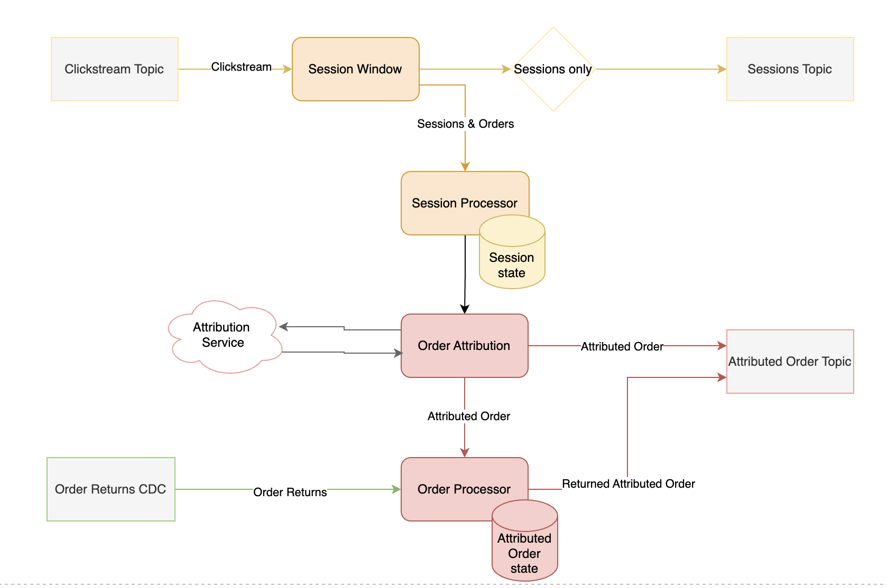

# Flink Sessionizer Job

## Overview
This job is designed to showcase the [Streaming Demo Platform](https://github.com/getindata/streaming-demo-platform).
Its main responsibility is to group incoming clickstream data into user sessions. The clickstream consists of `PageView` events and `Order` events.

Sessions are emitted from the session window on every event.
This approach provides instant information about clickstream traffic at any given moment.
Otherwise, sessions would only be emitted after the session window closes, which could take up to 24 hours in some edge cases. (More details about the sessioning logic are provided below.)

The emitted sessions are intended to be aggregated later using the ClickHouse SummingMergeTree engine.

In addition to immediately sending sessions into the `sessions` topic, they are also passed to the `SessionProcessor` component, where they are stored in Flink state.
Here, sessions wait for an Order event, which will retrieve the session from the state and send it to the `AttributionService`.

After attribution, orders — enriched with the attributed last session — are sent to the orders topic.
This topic is consumed by ClickPipes and ingested into the attributed_orders table.

Attributed orders are also processed by the `OrderProcessor`, where they are held in state, waiting for potential order returns.
Order returns come from an independent CDC source. If an order return occurs, the OrderProcessor retrieves the corresponding attributed order from the state, updates its returnTimestamp field, and sends the updated order back to the orders topic.
It is intended that reconciliation and deduplication of these updates will be handled on the ClickHouse side.

## Diagarm

## Session Window
Incoming events are grouped using a custom SessionWindow. 
